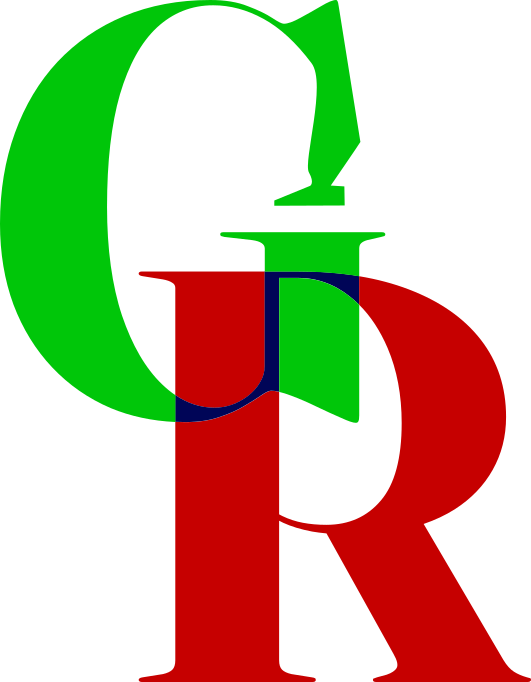

# GeoReforge

 <strong>Transform geographic references into business-ready zones.</strong><br clear="left">

[Français](README.fr.md) | English

[](https://www.python.org/)
[](https://flask.palletsprojects.com/)
[](https://www.sqlalchemy.org/)
[](https://gunicorn.org/)
[](https://www.sqlite.org/)
[](https://www.docker.com/)

GeoReforge is an open-source engine for building, transforming, and versioning business geographic zones from public geographic datasets.

Regulatory, tax, administrative, logistics, and commercial decisions often depend on geography. Organizations may need to know where a product can be sold, which regulations apply to a territory, or how to define and reuse a business zone across multiple applications.

Geographic datasets provide countries, regions, and administrative boundaries, but rarely the business-specific zones organizations need. GeoReforge aims to bridge that gap.

## How It Works

Starting from geographic datasets such as [Natural Earth](https://www.naturalearthdata.com/), [GADM](https://gadm.org/), or [geoBoundaries](https://www.geoboundaries.org/), GeoReforge aims to let you compose new zones from existing territories.

For example, a zone can be defined as the union of Belgium, the Netherlands, and Luxembourg:

```text
Belgium + Netherlands + Luxembourg = Benelux
```

Or a custom zone can be built by removing territories from Europe:

```text
Europe - Switzerland - United Kingdom = Custom zone
```

Generated zones are intended to become reusable geographic objects for other projects and systems.

## Philosophy

GeoReforge is not just about storing geometries. The project aims to make it possible to:

- describe how a zone is built;
- version its definition;
- reproduce its generation;
- export the result in different formats;
- reuse it in third-party systems.

A business zone can be described with rules, for example:

```yaml
zone:
  code: BENELUX
  name: Benelux
  from: 2026-01-01
  to: 2026-12-31

operations:
  - union:
    - belgium
    - netherlands
    - luxembourg
```

Keeping this definition in Git would make it auditable, reviewable, and regenerable over time.

## Use Cases

### Regulation

Associate regulations with geographic zones and determine which rules apply to a product or one of its components in a given territory.

```text
Product -> Components -> Regulations -> Zones -> Customer territory
```

### Taxation

Determine applicable tax rules based on a territory.

### Logistics

Build distribution and supply zones that match operational needs.

### Business Analysis

Create geographic groupings tailored to a specific activity.

### Data Engineering

Build and maintain reference datasets that enrich operational data.

## Target Capabilities

The following capabilities describe the project's goals; they are not a statement that every feature is already implemented.

### Geographic Datasets

- continents and countries;
- administrative regions;
- territorial subdivisions.

### Zone Construction

- unions, differences, and intersections of territories;
- nested zones;
- composite zones.

### Versioning and Reproducibility

- YAML-based definitions (or perhaps TOML);
- reproducible generation;
- change history.

### Export

- GeoJSON;
- Shapefile;
- GeoPackage;
- PostgreSQL/PostGIS;
- SQLite/SpatiaLite.

### API and Web Interface

- generate and inspect zones;
- explore geographic datasets;
- preview zones on a map and download generated artifacts;
- create zones visually and automate integrations.

## Architecture

[Detailed architecture](doc/Architecture.md)

```text
Geographic datasets
        |
        v
    GeoReforge <---- Versioned zone definitions
        |
        v
    Zone generation
        |
        v
    Output formats
        |
        v
GIS tools, APIs, and databases
```

## Project Goals

- Simplify the creation of business geographic datasets.
- Provide a reproducible, automatable generation engine.
- Make it easier to enrich data with geographic context.
- Reduce duplicated geographic definitions across applications.
- Support use both locally and in production.

## Who It Is For

- Data engineers and data analysts;
- GIS teams;
- data architects;
- business consultants;
- software vendors;
- open-source projects.

**GeoReforge does not aim to replace existing geographic datasets. Its goal is to turn them into business-ready geographic references that organizations can use and maintain.**

## Usage

There are several ways to use GeoReforge.

For using an external database, see the [database preparation guide](doc/DbPrepare.md).

### Run

To run GeoReforge with Docker, use the following command:

```sh
docker run --rm -v $(pwd)/database:/var/lib/app georeforge:latest
```

This starts a local GeoReforge instance and persists the database in the `database` directory on your machine.

You can also mount the `config.py` configuration file or the `env.conf` environment file as follows:

```sh
docker run --rm -v $(pwd)/database:/var/lib/app -v $(pwd)/config.py:/etc/app/config.py -v $(pwd)/env.conf:/etc/app/env.conf georeforge:latest
```

To run the Docker image as a specific user, add the `--user $(id -u):$(id -g)` option to the `docker run` command.

### Build

To use specific user and group IDs for `appuser` in the container, pass the `UID` and `GID` build arguments when building the Docker image:

```sh
docker build --build-arg UID=$(id -u) --build-arg GID=$(id -g) -t georeforge:latest .
```

You can then run the built image with the `docker run` command described above.

### Docker Compose

You can add GeoReforge to a `docker-compose.yaml` file as follows:

```yaml
services:
  georeforge:
    image: georeforge:latest
    volumes:
      - ./database:/var/lib/app
      - ./config.py:/etc/app/config.py
      - ./env.conf:/etc/app/env.conf
    environment:
      DB_PASSWORD: ${DB_PASSWORD}
      DB_USER: ${DB_USER}
      DB_NAME: ${DB_NAME}
      DB_SCHEMA: ${DB_SCHEMA}
      DB_HOST: ${DB_HOST}
      DB_PORT: ${DB_PORT}
```

Define the environment variables in a `.env` file at the root of your project, and create a `config.py` file based on the [configuration template](./src/config.py).
