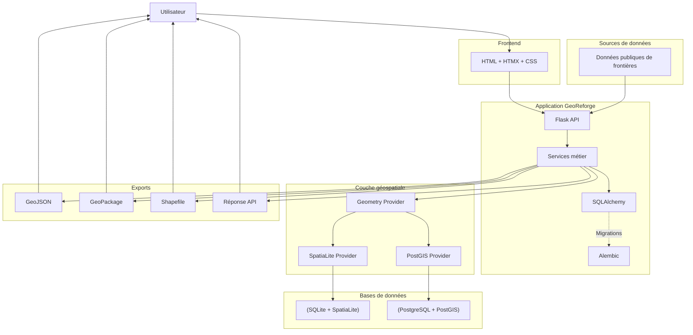
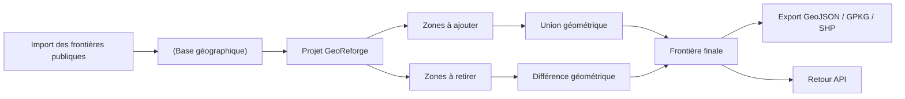

# Architecture cible

[Français] | [English](Architecture.md)

L'architecture cible est un projet conteneurisé, Single Node, cloud-native.

## Vision métier

D'un point de vue métier, le processus de gestion des frontières publiques dans GeoReforge peut être représenté comme suit :

