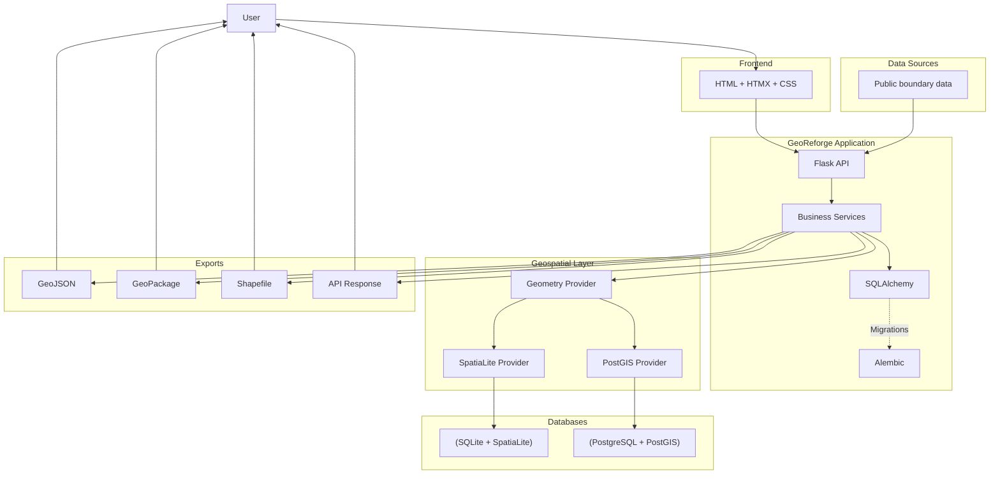
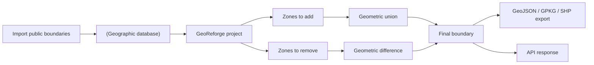

# Target Architecture

[Français](Architecture.fr.md) | English

The target architecture is a cloud-native, single-node, containerized application.

## Business View

From a business perspective, the process for managing public boundaries in GeoReforge can be represented as follows:

