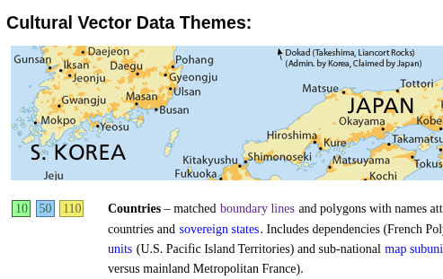
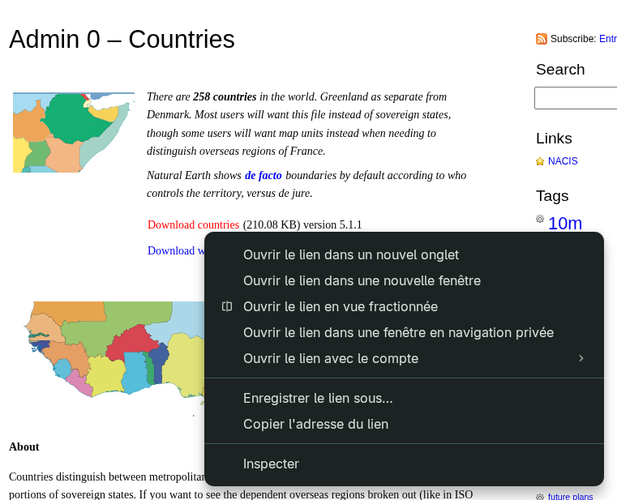

# Guide to creating the zones.toml file

The `zones.toml` file defines the geographic zones to download from Natural Earth.

By default, the container includes a file with high-, medium-, and low-resolution definitions for countries, oceans, and seas. You can customize this file by creating your own and following the guide below.

## zones.toml file structure

```toml
# Config file to define zones to download from the source path

# Natural Earth data source URL
source_path = "https://naturalearth.s3.amazonaws.com"

# Define three possible data families: cultural, physical, raster
[[data_family.cultural]]    # Cultural data family
name = "Countries"  # Display name of the zone in the user interface
precision = ["low", "medium", "high"]   # Available resolutions for this zone
link = "admin_0_countries"  # Part of the URL used to download the data

[[data_family.physical]]
name = "Oceans"
precision = ["low", "medium", "high"]
link = "ocean"

[[data_family.physical]]
name = "Marine Polygons"
precision = ["low", "medium", "high"]
link = "geography_marine_polys"
```

## Finding a zone's `precision` and `link`

Go to the [Natural Earth website](https://www.naturalearthdata.com/features/).



Each zone has three boxes showing the available resolutions:

- 10: high resolution
- 50: medium resolution
- 110: low resolution

Click the box for the zone and resolution you want to download.



Click _Copy link address_.

```text
https://www.naturalearthdata.com/http//www.naturalearthdata.com/download/110m/cultural/ne_110m_admin_0_countries.zip
```

In the filename, `ne` stands for Natural Earth and `110m` is the resolution (low in this example). Use only `admin_0_countries` as the `link` value in your `zones.toml` file.

For the `precision` field, use `low` for 110m, `medium` for 50m, and `high` for 10m. List only the resolutions you want to download; you do not have to include all of them.

```toml
[[data_family.cultural]]
name = "Countries"
precision = ["low", "medium", "high"]
link = "admin_0_countries"
```

Repeat these steps for each zone you want to add to your `zones.toml` file before starting the application for the first time.
